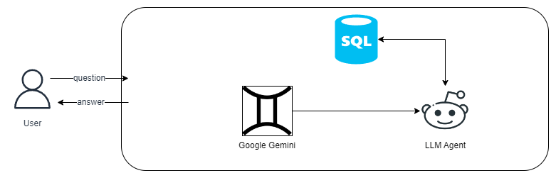

## SQL Database Support in LangChain

One of the most common types of databases that we can build Q&A systems for are SQL databases. LangChain comes with a number of built-in chains and agents that are compatible with any SQL dialect supported by SQLAlchemy (e.g., MySQL, PostgreSQL, Oracle SQL, Databricks, SQLite). They enable use cases such as:

- Generating queries that will be run based on natural language questions,
- Creating chatbots that can answer questions based on database data,
- Building custom dashboards based on insights a user wants to analyze.

## Approach:
###  SQL Agent in LangChain

LangChain offers a SQL Agent, providing a more flexible way of interacting with SQL Databases compared to chains. The main advantages of using the SQL Agent include:

- **Schema and Content Interaction**: The SQL Agent can answer questions based on the databases' schema as well as on the databases' content (e.g., describing a specific table).
- **Error Recovery**: It can recover from errors by running a generated query, catching the traceback, and regenerating it correctly.
- **Query Flexibility**: The SQL Agent can query the database as many times as needed to answer the user question.
- **Efficient Token Usage**: It will save tokens by only retrieving the schema from relevant tables.

To initialize the agent, we'll use the `create_sql_agent` constructor. This agent utilizes the SQLDatabaseToolkit, which contains tools to:

- Create and execute queries
- Check query syntax
- Retrieve table descriptions
- ... and more

### High Level Design:

